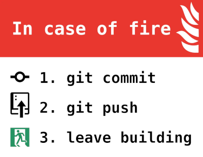

# Agenda

* [Why Github?](#why-github)
* [What is Github?](#what-is-github)
* [Workshop](#workshop)
* [How it works](#how-it-works)
* [Workshop exercise](#workshop)
* [Preparation](#preparation)
* [Hands-on lab](#hands-on)

# Why Github?

GitHub allows you to collaborate on automation/code projects. There are several reasons why this is beneficial for you and me.

  * Version control: Did you ever create a script and it doesn´t work anymore after some changes? Git is a powerful version control system that allows you to track and view changes to your scripts/code over time.

  * Collaboration: GitHub provides a platform to collaborate on code with others. Developers can work on the same codebase, manage issues, and review each other's code.

  * Open source: GitHub is home to a vast number of open-source projects. These projects are available to anyone to use, modify, and contribute to, see: ['Free software, Free society' by RMS](https://www.youtube.com/watch?v=Ag1AKIl_2GM)

  * Community: GitHub has a large and active community of people who share code, collaborate on projects, and help each other with technical issues.

  * Integration: GitHub integrates with a wide range of tools and services, making it easy to automate tasks like testing, building, and deploying code.

__Overall, GitHub is a valuable tool for people who want to collaborate on code, contribute to open-source projects, and manage their code more effectively.__

---

# What is Github?

* Git is a version control software. You can use to maintain change history while you keep changing your code. Also it is helpful if more people are involved in the same project.

* GitHub - It's where you keep copy of your code (with change history) so that people can access your code anytime without having to come to your computer. It is maintained by Microsoft.

* Gitlab - Same as GitHub, but being maintained by different group.

As stated above; GitHub is a collaboration tool for people working on automation/code projects.

To fully understand and use GitHub, it's important to have a basic understanding of the following parts:

* Code (Repository)
  * Privateitle
  * Public
* Issues
* Pull request
* Actions
* Projects
* Wiki
* Security
* Insights
* Settings (where the repo can be deleted, confirmation)

# How it works:

  * Text based on [markdown language](https://www.markdownguide.org/cheat-sheet/)
  * Clone the repository
    * Start by cloning the repository to your local machine.
    * Create a new branch: Always create a new branch before starting any work.
    * Make changes: Now you can make any changes you need to make to the 'local branch' files on your laptop.
    * Stage changes: Once you have made your changes, you need to stage them. Make sure to stage all the files which are related to specific functionality, see `breaking commits`. __---- NEEDS LINK TO RELEVANT ITEM ----__
    * Commit changes: Once you have staged your changes, you can commit them in your local git clone. Remember to add a meaningful commit message that describes the changes you made.
    * Merge changes: If you are working in a team, someone else may have made changes to the same branch. In that case, you will need to merge their changes with yours before pushing.
    * Push changes: Finally, you need to push your changes to the remote repository. This makes your changes available to others, publicly or privately.
    * Pull changes: Before you start working again, you should always pull the latest changes from the remote repository.

It's a best practice to always commit and push your changes at the end of the working day/shift, so that the repo is always up to date.

# Workshop

What you are going to do? 
itle
Explore the possibilities of GitHub by creating your own repo, adding files.

See how branches work, locally and remotely and combined with pull requests.

## Preparation

Install the prerequisites:

* [`Sign in`](https://github.com/login) or [`Sign up`](https://github.com/signup) for your GitHub account.
* Install [GitHub Desktop](https://desktop.github.com/) on your laptop.
* Install [Visual Studio Code](https://code.visualstudio.com/download) on your laptop.
* Add [YAML plugin (Redhat)](https://marketplace.visualstudio.com/items?itemName=redhat.vscode-yaml) in Visual Studio Code.
* Add [indent-rainbow plugin](https://marketplace.visualstudio.com/items?itemName=oderwat.indent-rainbow) in Visual Studio Code.

## Hands-on:

* Create a new private or public repository.
* Create README.MD as heading type `H1`. Hint use the [Markdown cheat sheet](https://www.markdownguide.org/cheat-sheet/)
* Customize README.MD as a sub-heading.
* Customize README.MD by adding an index or [table of contents](https://www.markdownguide.org/hacks/#table-of-contents) to the sub-heading.
* Create feature branch
* Create PR to own main repo, explain 4 eyes principle
* Create Github action workflow with Linux and Windows VM (explain that this is an Azure VM, 2000 minutes free per month to use)
* Github action workflow add action download repository files
* Github action workflow add export to text file Linux and Windows
* Github action workflow add upload artifact
* Github action workflow add dependency build->release
* Github action workflow add pre-release

## First code of conduct:

